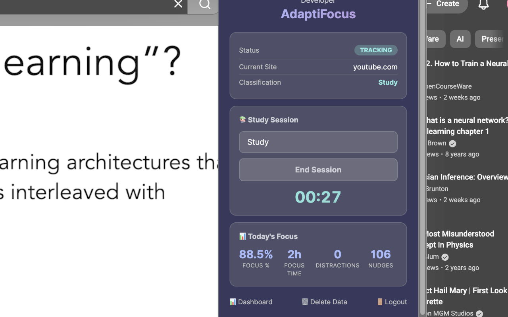
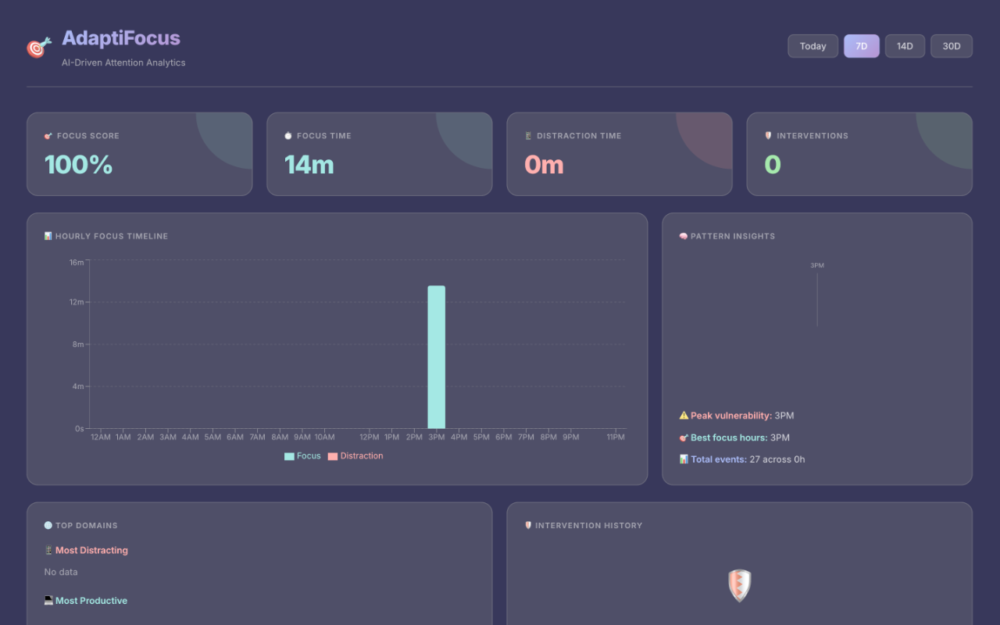

# 🎯 AdaptiFocus Beta Installation Guide

Thank you for trying out AdaptiFocus! 

Since the extension is currently in Beta, it is not yet available on the Chrome Web Store. You will need to load it directly into Google Chrome using "Developer Mode". It only takes **2 minutes**.

> **Privacy First**: AdaptiFocus **DOES NOT** track the specific URLs you visit or the content of the pages. It only securely logs the master domain (like `youtube.com`) and how long you stayed there.

---

## 🚀 Phase 1: Install the Extension

1. **Download & Extract:** Download the extension by clicking here: [extension.zip (v0.9.0-beta)](https://github.com/PrageethBanuka/adaptifocus/releases/download/v0.9.0-beta/extension.zip). Double-click the downloaded file to unzip it into a folder on your computer.
2. **Open Extensions:** Open Google Chrome. Copy and paste `chrome://extensions/` into your URL bar and hit Enter.
3. **Developer Mode:** In the top-right corner of the Extensions page, you will see a toggle for **Developer mode**. Turn it **ON**.
4. **Load Unpacked:** Because you turned on Developer mode, a new **Load unpacked** button will appear in the top-left corner. Click it.
5. **Select Folder:** Select the *unzipped* extension folder from Step 1.
6. **Pin It:** The extension is now installed! Click the puzzle piece icon 🧩 next to your Chrome URL bar and click the pin 📌 next to AdaptiFocus so it stays visible on your browser.

---

## 👤 Phase 2: Create Your Account

Now that the extension is installed, you need to create your account so your study data can be recorded.

1. Click the 🎯 AdaptiFocus icon in your toolbar.
2. Under the "Development Login" section, click the grey **Sign Up** button.
3. Enter your **First Name** and your **Email Address**.
4. Click **Sign Up** one more time to instantly create your test account.

*(Note: Because the research server goes to sleep when not in use, you might see a "⏳ Waking up server..." message. This is normal and can take up to 50 seconds!)*

---

## 📊 Phase 3: Start Browsing!

You're all set! **Just browse normally.**

The AI will silently analyze your browsing habits in the background. The extension icon will change dynamically to show you how you're doing:
* **Green (FOCUS)**: When you are on a highly productive or study-related site.
* **Red (⚠️)**: When you are actively distracted.

Click the extension icon and click **📊 Dashboard** to view your beautiful web dashboard and track your focus stats over time!

### 🖼️ Previews
**The Extension Popup:**

**The Analytics Dashboard:**

**Issues?** Please message the researcher directly on WhatsApp if you have any questions or bugs.
